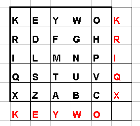
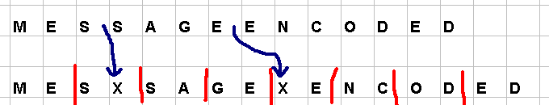
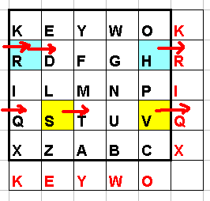
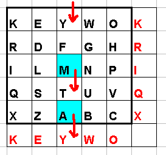
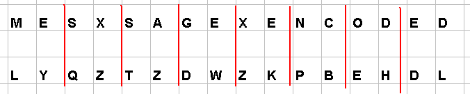

# Cipher Algorithms   
This code helps you to understand the different Searching algorithms. The sorting algorithms depicted in this code are:

1. Caesar Cipher
2. Monoalphabetic Cipher
3. Playfair Cipher

### Sourcerer

### Code Requirements
The example code is in Python ([version 3.8](https://www.python.org/downloads/) or higher will work).

### Description
In cryptography, a cipher (or cypher) is an algorithm for performing encryption or decryption—a series of well-defined steps that can be followed as a procedure. An alternative, less common term is encipherment. To encipher or encode is to convert information into cipher or code. In common parlance, "cipher" is synonymous with "code", as they are both a set of steps that encrypt a message; however, the concepts are distinct in cryptography, especially classical cryptography.

For more information, [see](https://en.wikipedia.org/wiki/Cipher)

## Caesar Cipher

## Monoalphabetic Cipher

## Playfair Cipher
Follow these steps to encode with Playfair.

First make the grid using your keyword. Carry the alphabet on from the end of the keyword, missing out repeated letters.

Now break your message up into pairs. You must pad any pairs of repeated letters with an X. Pad the end of the message with an X as well if need be.

#### Letters in the SAME ROW
Letters in the same row encipher using the letter immediately to the RIGHT. The grid wraps around itself. Thus
SV→TQ
RH→DR
HR→RD

#### Letters in the SAME COLUMN
Letters in the same column encipher using the letter immediately BELOW. The grid wraps around itself. Thus
MA→TY
AM→YT

#### Letters in DIFFERENT ROWS AND COLUMNS
Find the rectangle formed by the rows and columns containing the letter pair. The plain text letter pair forms one diagonal of this rectangle. The ciphertext letters are given by the other diagonal. Each plaintext letter is encoded by the letter on its row belonging to the ciphertex diagonal of the rectangle
DU→GS
UD→SG

The message is encoded as follows:

