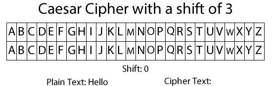

# Cipher Algorithms   
This code helps you to understand the different Searching algorithms. The sorting algorithms depicted in this code are:

1. Caesar Cipher
2. Monoalphabetic Cipher
3. Playfair Cipher

### Sourcerer

### Code Requirements
The example code is in Python ([version 3.8](https://www.python.org/downloads/) or higher will work).

### Description
In cryptography, a cipher (or cypher) is an algorithm for performing encryption or decryption—a series of well-defined steps that can be followed as a procedure. An alternative, less common term is encipherment. To encipher or encode is to convert information into cipher or code. In common parlance, "cipher" is synonymous with "code", as they are both a set of steps that encrypt a message; however, the concepts are distinct in cryptography, especially classical cryptography.

For more information, [see](https://en.wikipedia.org/wiki/Cipher)

